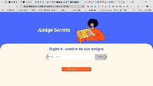

# Amigo Secreto

Este es un proyecto simple de "Amigo Secreto" creado con HTML, CSS y JavaScript. Permite a los usuarios ingresar nombres de amigos, realizar un sorteo aleatorio y determinar quién es el amigo secreto.

## Funcionalidades

* **Agregar nombres:** Los usuarios pueden ingresar nombres de amigos mediante un campo de texto y agregarlos a una lista.
* **Validación de entrada:** Se muestra una alerta si el campo de texto está vacío.
* **Visualización de la lista:** Los nombres ingresados se muestran en una lista en la página.
* **Sorteo aleatorio:** Al hacer clic en el botón "Sortear amigo", se selecciona un nombre aleatorio de la lista y se muestra el resultado.
* **Reinicio del juego:** Después de realizar el sorteo, el botón cambia a "Reiniciar Juego", permitiendo iniciar un nuevo sorteo con una nueva lista de amigos.

## Cómo usar

1.  Abre el archivo `index.html` en tu navegador web.
2.  Ingresa los nombres de tus amigos en el campo de texto y haz clic en "Añadir".
3.  Cuando hayas ingresado todos los nombres, haz clic en "Sortear amigo".
4.  El nombre del amigo secreto se mostrará en la página.
5.  Para reiniciar el juego y realizar un nuevo sorteo, haz clic en "Reiniciar Juego".

## Estructura de archivos

* `index.html`: Estructura HTML de la página.
* `app.js`: Lógica JavaScript de la aplicación.
* `style.css`: Estilos CSS de la página.
* `assets/`: Carpeta que contiene imágenes utilizadas en la página.

## Personalización

* Puedes personalizar los estilos de la página modificando el archivo `style.css`.
* Puedes cambiar las imágenes utilizadas en la página reemplazando los archivos en la carpeta `assets/`.
* Puedes modificar la lógica del sorteo en el archivo `app.js` para agregar funcionalidades adicionales.
